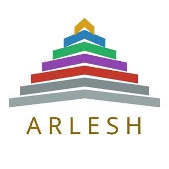

<p align="center">
  
</p>

# Arlesh

*From Ursule Le Guin's fictional language of Werel, roughly "Dao".*

A comprehensive task management system oriented towards tree structure, supporting complex organization over multiple domains, dependencies between tasks, a "Waits" resource for asyncronous tasks, usage by AI Agents, and much more.

Runs as a cross-platform native app, built with [Tauri](https://v2.tauri.app/).

# Features

## Structural Resources

- **Aspects** are top level divisions inspired by Maslow's hierarchy of needs: Self, Body, Connections, Growth, Duty, Flow
- **Domains** are divisions inside this, effectively serving as directories. They can be used with whatever schema is relevant.
- **Projects** are more concrete domains, usually depicting a central long term responsability or goal, sitting right below aspects.
- **Goals** define desired end states, that you can file tasks under.
- **Flows** define templates of goals and tasks, to copy unto any node
- **Tags** can sit under any resource and add additional, non-hierarchical layer of organization and query.
- **Scopes** define time ranges at different levels: Season -> Month -> Week -> Day -> Part-Of-Day. You plan in changes, specifying more as you near a scope.

## Actionable Resources
- **Tasks** are action items. They can be scoped for relevance and planned, depend on other tasks and expectations (see below), and also be marked block for reasons specified in string.
- **Commitments** are decisions you can't just complete with an action -
- **Expectations** are things you're waiting on, you can set a "Check" interval that will generate tasks to check the expectation status.
- **Habits** are flows repeated in intervals. They can be complex trees or a flat node, and use any of the other actionable resources. They have a destructive and occumulating mode - tasks that die and respawn, and tasks that stay until overdue.

Habit instances and expectation checks are virtual and fully derived, so no fiddly materialization or syncing problems, but they can be edited over the template.

## Views

Three views (`Ctrl+M`, `Ctrl+L` and `Ctrl+P`, or the view tabs in the top bar):
- **Mindmap** — a left-right balanced tree editor for navigating and building the task hierarchy
- **Steps** — a flat view to look at the tree on level at at a time.
- **List** — a list of the actionable resources to serve as your to do list, with extensive filtering options
- **Plan** — a two-pane triage over one scope at a time: unscheduled work that is relevant now on the left, what the scope already holds on the right, and moving a card across sets its Plan

Tabs and windows are supported.

Every view is keyboard-driven; `Ctrl+Shift+/` opens a cheat-sheet listing every binding.

## Filters
Arlesh gives three four modes to look at the task list:

- **All:** see everything.
- **Plan**: see unresolved items currently relevant - removing done or missed, but leaving blocked
- **Start**: see only unblocked todo items
- **Do**: active in progress items

List View has two additional modes -- **Unblock** shows only blocked tasks, **Backlog** shows backlog.

It also supports additional filtering by various conditions - antedecants, tags, and many flags on the tasks. Filters are added as pills that can cycle **All**, **Any**, and **Not** modes, allowing easy creation of complex queries.


## Agent access

While the app is running it serves an MCP. You configure root nodes available from it in the app settings, and the agent can read and create nodes between them.
You can mark a task agentic to allow the agent to edit it. 

Agentic tasks also get additional fields: spec, design, acceptance criteria and notes, for the agent to use. Spec must be given for agentic tasks to change status.
The MCP also allows creating agent *Agentic Expectations*, which can present a question you can answer and relase from the UI. It serves for agents to model blocking underspecification and asyncronous tasks (waiting for CI).


The [MCP](https://modelcontextprotocol.io) serves at `http://127.0.0.1:4747/mcp`.

```
claude mcp add --transport http Arlesh http://127.0.0.1:4747/mcp
```

The endpoint only answers while Arlesh is open; with the app closed the server simply fails to
connect.

## Additional Features

- Nodes can be marked private; toggle private visibility in settings, so you can manage more personal action items but use the app calmly in a public setting.
- Tasks can be marked *asynchronous*, to mark that they trigger a wait (like sending someone a message, then waiting for a response). You can also attach the marker an expectation template, and it will derive an expectation for asyncronous tasks marked done.
- Tasks can be backlogged, hiding them from the plan filter.
- Close to tray.


# Development 

## Documentation

Full spec at docs/spec/ dir, with top level reference at SPEC.md
Important decisions reflected in docs/adr/ and changelog.d/
Agents configured via CLAUDE.md and .claude/, with arlesh itself serving as an MCP for task management.

## Stack

| Layer     | Choice                        |
|-----------|-------------------------------|
| Framework | Tauri 2.0                     |
| Frontend  | React + TypeScript            |
| Mindmap   | Custom SVG renderer (D3 tree) |
| Storage   | SQLite                        |

## Roadmap

Arlesh is planned to extend beyond task management, to add knowledge base capabilities via mapping a graph of structured concepts, integrated with Obsidian, also integrating with a daily journal.


